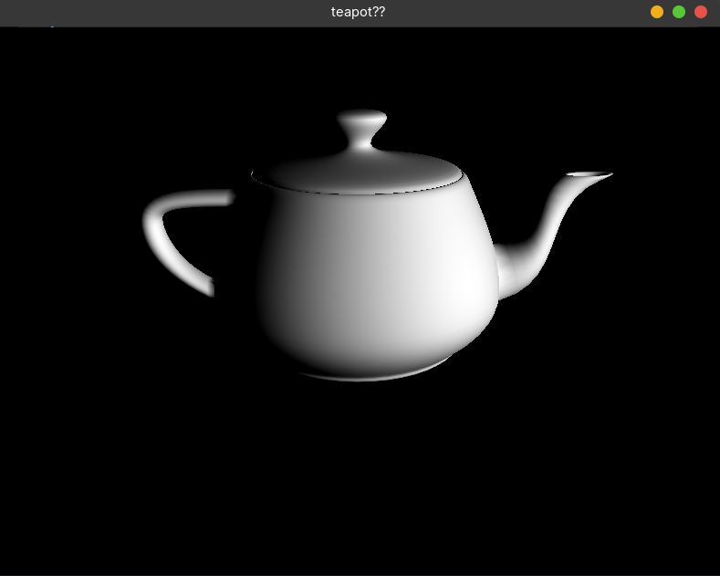

# 🫖 OpenGL Teapot

A simple C++ and OpenGL application that loads and renders the classic **Utah Teapot** 3D model.



---

## 📁 Project Structure

```text
.
├── app
├── buffers.cpp
├── buffers.h
├── camera.cpp
├── camera.h
├── draw.cpp
├── draw.h
├── glad
│   ├── include
│   │   ├── glad
│   │   │   └── glad.h
│   │   └── KHR
│   │       └── khrplatform.h
│   └── src
│       └── glad.c
├── main.cpp
├── mainwindow.cpp
├── mainwindow.h
├── Makefile
├── shaders
│   ├── fragmentshader.glsl
│   └── vertexshader.glsl
├── teapot.obj
├── vertex.cpp
└── vertex.h
